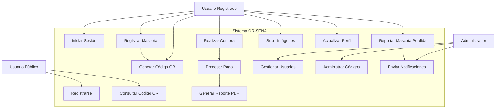
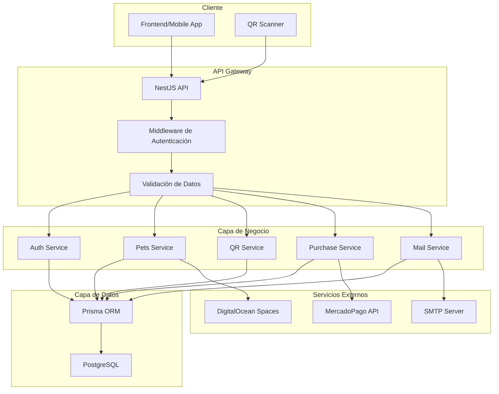

# MANUAL TÉCNICO DEL SISTEMA QR-SENA

## TABLA DE CONTENIDO

**PRESENTACIÓN** ...................................................................................................5

**RESUMEN**..............................................................................................................6

**OBJETIVO**..............................................................................................................7

**FINALIDAD DEL MANUAL** .....................................................................................7

**INTRODUCCIÓN**....................................................................................................8

**1. ASPECTOS TÉCNICOS**..................................................................................9
1.1. HERRAMIENTAS UTILIZADAS PARA EL DESARROLLO........................9
1.1.1. Visual Studio Code / Sublime Text ........................................................................................9
1.1.2. GitHub.................................................................................................9
1.1.3. Docker...............................................................................................10
1.1.4. Node.js y NestJS...............................................................................10
1.1.5. Prisma ORM......................................................................................11
1.1.6. PostgreSQL......................................................................................11

**2. DIAGRAMAS DE MODELAMIENTO** .............................................................12
2.1. DIAGRAMA DE CLASES.........................................................................12
2.2. DIAGRAMA DE CASOS DE USO............................................................14
2.3. DICCIONARIO DE DATOS......................................................................16

**3. ASPECTO TÉCNICO DEL DESARROLLO DEL SISTEMA** ...........................18
3.1. ARQUITECTURA DEL SISTEMA.............................................................18
3.2. ESTRUCTURA DE MÓDULOS.................................................................19
3.3. CONFIGURACIÓN LOCAL......................................................................21
3.4. DESPLIEGUE CON DOCKER..................................................................22

**4. REQUERIMIENTOS DEL SOFTWARE** .........................................................23
4.1. REQUISITOS MÍNIMOS..........................................................................23
4.2. DEPENDENCIAS DEL PROYECTO.........................................................24

**BIBLIOGRAFÍA**.....................................................................................................25

---

## PRESENTACIÓN

El presente manual técnico documenta el sistema **QR-SENA**, una aplicación web desarrollada para la gestión de mascotas mediante códigos QR. Este sistema permite el registro de mascotas, generación de códigos QR únicos, reportes de mascotas perdidas y gestión de compras de productos relacionados.

El manual está dirigido a desarrolladores, administradores de sistemas y personal técnico que requiera comprender la arquitectura, implementación y mantenimiento del sistema QR-SENA.

---

## RESUMEN

QR-SENA es una API REST desarrollada con **NestJS** y **TypeScript** que implementa un sistema completo de gestión de mascotas mediante códigos QR. El sistema utiliza **Prisma** como ORM para la gestión de datos con una base de datos **PostgreSQL**, y está containerizado con **Docker** para facilitar el despliegue.

### Características principales:
- **Gestión de usuarios**: Registro, autenticación y autorización mediante JWT
- **Registro de mascotas**: Creación de perfiles de mascotas con códigos QR únicos  
- **Sistema de códigos QR**: Generación y validación de códigos únicos para identificación
- **Reportes de mascotas perdidas**: Sistema de alertas y notificaciones
- **Gestión de compras**: Procesamiento de órdenes y pagos mediante MercadoPago
- **Generación de reportes**: Creación de documentos PDF para compras
- **Sistema de archivos**: Gestión de imágenes en la nube (DigitalOcean Spaces)
- **Notificaciones**: Sistema de emails automatizado

---

## OBJETIVO

El objetivo principal de este manual técnico es proporcionar una guía completa y detallada sobre:

1. **Arquitectura del sistema**: Describir la estructura modular y las tecnologías implementadas
2. **Configuración del entorno**: Explicar los pasos necesarios para configurar el entorno de desarrollo
3. **Funcionamiento técnico**: Documentar los procesos internos y flujos de datos
4. **Mantenimiento**: Proporcionar información para el mantenimiento y actualización del sistema

---

## FINALIDAD DEL MANUAL

Este manual técnico tiene como finalidad:

- **Facilitar el mantenimiento** del sistema por parte del equipo de desarrollo
- **Documentar la arquitectura** para futuras expansiones o modificaciones
- **Proporcionar guías de instalación** para diferentes entornos (desarrollo, producción)
- **Establecer estándares** de desarrollo y buenas prácticas implementadas
- **Servir como referencia** para la resolución de problemas técnicos
- **Facilitar la incorporación** de nuevos desarrolladores al proyecto

---

## INTRODUCCIÓN

El sistema QR-SENA surge de la necesidad de crear una solución tecnológica moderna para la identificación y gestión de mascotas mediante códigos QR. La aplicación permite a los usuarios registrar sus mascotas, generar códigos QR únicos que pueden ser utilizados en collares o placas identificativas, y gestionar reportes en caso de que la mascota se extravíe.

### Contexto tecnológico:
El sistema está desarrollado utilizando tecnologías modernas de desarrollo web, siguiendo patrones de arquitectura escalables y mantenibles. La implementación se basa en:

- **Backend**: API REST con NestJS y TypeScript
- **Base de datos**: PostgreSQL con Prisma ORM  
- **Contenedorización**: Docker para portabilidad y escalabilidad
- **Integración de pagos**: MercadoPago para procesamiento de transacciones
- **Almacenamiento en la nube**: DigitalOcean Spaces para archivos multimedia

### Funcionalidades principales:
1. **Módulo de autenticación**: Gestión segura de usuarios con roles y permisos
2. **Módulo de mascotas**: Registro completo de información de mascotas
3. **Módulo de códigos QR**: Generación y validación de códigos únicos
4. **Módulo de reportes**: Gestión de mascotas perdidas y encontradas
5. **Módulo de compras**: Procesamiento de órdenes de productos personalizados
6. **Módulo administrativo**: Herramientas de gestión para administradores

---

## 1. ASPECTOS TÉCNICOS

### 1.1. HERRAMIENTAS UTILIZADAS PARA EL DESARROLLO

#### 1.1.1. Visual Studio Code / Sublime Text

**Descripción**: Entorno de desarrollo integrado (IDE) utilizado para la escritura y edición del código fuente.

**Características utilizadas**:
- Resaltado de sintaxis para TypeScript y JavaScript
- Extensiones específicas para NestJS y Prisma
- Integración con Git para control de versiones
- Terminal integrado para ejecución de comandos
- Depurador integrado para Node.js

**Configuración recomendada**:
```json
{
  "editor.formatOnSave": true,
  "editor.codeActionsOnSave": {
    "source.fixAll.eslint": true
  },
  "typescript.preferences.includePackageJsonAutoImports": "on"
}
```

#### 1.1.2. GitHub

**Descripción**: Plataforma de desarrollo colaborativo basada en Git para el control de versiones y gestión del código fuente.

**Uso en el proyecto**:
- **Repositorio principal**: Almacenamiento del código fuente
- **Control de versiones**: Gestión de cambios y historial del proyecto
- **Ramas de desarrollo**: Organización del flujo de trabajo
- **Issues y Pull Requests**: Gestión de tareas y revisión de código
- **Actions**: Automatización de CI/CD (Integración y Despliegue Continuo)

**Estructura de ramas**:
- `main`: Rama principal de producción
- `develop`: Rama de desarrollo
- `feature/*`: Ramas para nuevas características
- `hotfix/*`: Ramas para correcciones urgentes

#### 1.1.3. Docker

**Descripción**: Plataforma de contenedorización que permite empaquetar la aplicación y sus dependencias en contenedores portables.

**Implementación en QR-SENA**:
- **Dockerfile**: Configuración del contenedor de la aplicación
- **docker-compose.yml**: Orquestación de servicios (aplicación + base de datos)
- **Imágenes utilizadas**:
  - `node:18-alpine`: Imagen base para la aplicación
  - `postgres:15.3`: Base de datos PostgreSQL

**Configuración de contenedores**:
```yaml
services:
  app:
    build: 
      context: .
      dockerfile: Dockerfile
    ports:
      - "3000:3000"
    depends_on:
      - db
  
  db:
    image: postgres:15.3
    environment:
      POSTGRES_DB: qr_sena
      POSTGRES_USER: postgres
      POSTGRES_PASSWORD: password
```

#### 1.1.4. Node.js y NestJS

**Node.js**:
- **Versión**: 18.x LTS
- **Runtime**: Entorno de ejecución para JavaScript en el servidor
- **Gestor de paquetes**: npm/yarn para gestión de dependencias

**NestJS**:
- **Versión**: 11.x
- **Framework**: Framework progresivo para Node.js basado en TypeScript
- **Arquitectura**: Modular, inspirada en Angular
- **Características utilizadas**:
  - Inyección de dependencias
  - Decoradores para definir controladores y servicios
  - Guards para autenticación y autorización
  - Pipes para validación de datos
  - Interceptors para transformación de respuestas

**Estructura modular**:
```typescript
@Module({
  imports: [ConfigModule, AuthModule, PetsModule],
  controllers: [AppController],
  providers: [AppService],
})
export class AppModule {}
```

#### 1.1.5. Prisma ORM

**Descripción**: ORM (Object-Relational Mapping) moderno para TypeScript y Node.js.

**Características implementadas**:
- **Schema declarativo**: Definición de modelos en `schema.prisma`
- **Migraciones automáticas**: Sincronización de cambios en la base de datos
- **Type Safety**: Generación automática de tipos TypeScript
- **Query Builder**: Constructor de consultas tipado

**Ejemplo de modelo**:
```prisma
model Pet {
  id         String   @id @default(uuid())
  name       String   @db.VarChar(100)
  age        Int
  species    String   @db.VarChar(100)
  breed      String   @db.VarChar(100)
  gender     String   @db.VarChar(10)
  size       String   @db.VarChar(10)
  image      String?  @db.Text
  created_at DateTime @default(now())
  
  petCode    PetCode  @relation(fields: [petCode_id], references: [id])
  petCode_id String   @unique
  owner      User     @relation(fields: [owner_id], references: [id])
  owner_id   String
}
```

#### 1.1.6. PostgreSQL

**Descripción**: Sistema de gestión de base de datos relacional objeto-relacional de código abierto.

**Configuración en el proyecto**:
- **Versión**: 15.3
- **Codificación**: UTF-8
- **Esquema**: Definido a través de Prisma Schema
- **Conexión**: Pool de conexiones gestionado por Prisma

**Tablas principales**:
- `User`: Gestión de usuarios del sistema
- `Pet`: Información de mascotas registradas
- `PetCode`: Códigos QR únicos para identificación
- `Purchase`: Gestión de compras y pedidos
- `LostPetReport`: Reportes de mascotas perdidas

---

## 2. DIAGRAMAS DE MODELAMIENTO

### 2.1. DIAGRAMA DE CLASES

El diagrama de clases representa la estructura orientada a objetos del sistema QR-SENA, mostrando las entidades principales y sus relaciones.

```mermaid
classDiagram
    class User {
        +String id
        +String name
        +String last_name
        +String phone
        +String email
        +String password
        +Boolean is_active
        +String[] roles
        +DateTime created_at
        +Pet[] pets
        +Purchase[] purchases
    }
    
    class Pet {
        +String id
        +String name
        +Int age
        +String species
        +String breed
        +String gender
        +String size
        +String image
        +DateTime created_at
        +String petCode_id
        +String owner_id
    }
    
    class PetCode {
        +String id
        +String code
        +Boolean claimed
        +DateTime claimed_at
    }
    
    class Purchase {
        +String id
        +String user_id
        +Decimal total_price
        +OrderStatus status
        +BigInt payment_id
        +DateTime created_at
        +PurchaseItem[] items
        +ShippingInfo shippingInfo
    }
    
    class PurchaseItem {
        +String id
        +String purchase_id
        +PlateType type
        +Decimal unit_price
        +String name_to_engrave
    }
    
    class ShippingInfo {
        +String id
        +String full_name
        +String phone
        +String address
        +String city
        +String state
        +String postal_code
        +String carrier
        +String tracking_code
        +ShippingStatus status
        +String purchase_id
    }
    
    class LostPetReport {
        +String id
        +String pet_id
        +String message
        +String location
        +Boolean is_active
        +DateTime created_at
    }
    
    User ||--o{ Pet : owns
    Pet ||--|| PetCode : has
    Pet ||--o{ LostPetReport : reports
    User ||--o{ Purchase : makes
    Purchase ||--o{ PurchaseItem : contains
    Purchase ||--|| ShippingInfo : has
```

**Descripción de relaciones**:

1. **User - Pet**: Un usuario puede tener múltiples mascotas (1:N)
2. **Pet - PetCode**: Cada mascota tiene un código QR único (1:1)
3. **Pet - LostPetReport**: Una mascota puede tener múltiples reportes de pérdida (1:N)
4. **User - Purchase**: Un usuario puede realizar múltiples compras (1:N)
5. **Purchase - PurchaseItem**: Una compra puede contener múltiples artículos (1:N)
6. **Purchase - ShippingInfo**: Cada compra tiene información de envío única (1:1)

### 2.2. DIAGRAMA DE CASOS DE USO

El diagrama de casos de uso ilustra las funcionalidades principales del sistema desde la perspectiva de los diferentes tipos de usuarios.



**Actores del sistema**:

1. **Usuario Público**: Cualquier persona que accede al sistema
   - Puede consultar códigos QR
   - Puede registrarse en el sistema

2. **Usuario Registrado**: Usuario autenticado en el sistema
   - Puede registrar mascotas
   - Puede generar códigos QR
   - Puede reportar mascotas perdidas
   - Puede realizar compras
   - Puede gestionar su perfil

3. **Administrador**: Usuario con privilegios administrativos
   - Puede gestionar usuarios
   - Puede administrar códigos QR
   - Puede enviar notificaciones
   - Tiene acceso a todas las funcionalidades

**Casos de uso principales**:

1. **UC1 - Registrarse**: Permite a usuarios nuevos crear una cuenta
2. **UC2 - Iniciar Sesión**: Autenticación de usuarios existentes
3. **UC3 - Registrar Mascota**: Creación de perfil de mascota
4. **UC4 - Generar Código QR**: Creación de código único para la mascota
5. **UC5 - Consultar Código QR**: Verificación de información mediante código
6. **UC6 - Reportar Mascota Perdida**: Creación de alerta de mascota extraviada
7. **UC7 - Realizar Compra**: Proceso de compra de productos
8. **UC8 - Procesar Pago**: Integración con plataforma de pagos
9. **UC9 - Generar Reporte PDF**: Creación de documentos de compra
10. **UC10 - Gestionar Usuarios**: Administración de cuentas de usuario
11. **UC11 - Administrar Códigos**: Gestión de códigos QR del sistema
12. **UC12 - Enviar Notificaciones**: Sistema de alertas por email
13. **UC13 - Subir Imágenes**: Gestión de archivos multimedia
14. **UC14 - Actualizar Perfil**: Modificación de información personal

### 2.3. DICCIONARIO DE DATOS

El diccionario de datos define todas las entidades, atributos y relaciones del sistema QR-SENA.

#### Tabla: User
| Campo | Tipo | Longitud | Restricciones | Descripción |
|-------|------|----------|---------------|-------------|
| id | UUID | 36 | PRIMARY KEY, NOT NULL | Identificador único del usuario |
| name | VARCHAR | 100 | NOT NULL | Nombre del usuario |
| last_name | VARCHAR | 100 | NOT NULL | Apellido del usuario |
| phone | VARCHAR | 20 | NOT NULL | Número telefónico |
| email | VARCHAR | 256 | UNIQUE, NOT NULL | Correo electrónico |
| password | VARCHAR | 256 | NOT NULL | Contraseña encriptada |
| is_active | BOOLEAN | - | DEFAULT TRUE | Estado activo del usuario |
| roles | ARRAY | - | DEFAULT ['user'] | Roles asignados al usuario |
| created_at | TIMESTAMP | - | DEFAULT NOW() | Fecha de creación |

#### Tabla: Pet
| Campo | Tipo | Longitud | Restricciones | Descripción |
|-------|------|----------|---------------|-------------|
| id | UUID | 36 | PRIMARY KEY, NOT NULL | Identificador único de la mascota |
| name | VARCHAR | 100 | NOT NULL | Nombre de la mascota |
| age | INTEGER | - | NOT NULL | Edad en años |
| species | VARCHAR | 100 | NOT NULL | Especie (perro, gato, etc.) |
| breed | VARCHAR | 100 | NOT NULL | Raza de la mascota |
| gender | VARCHAR | 10 | NOT NULL | Género (macho/hembra) |
| size | VARCHAR | 10 | NOT NULL | Tamaño (pequeño/mediano/grande) |
| image | TEXT | - | NULLABLE | URL de la imagen |
| created_at | TIMESTAMP | - | DEFAULT NOW() | Fecha de registro |
| petCode_id | UUID | 36 | FOREIGN KEY, UNIQUE | Referencia al código QR |
| owner_id | UUID | 36 | FOREIGN KEY, NOT NULL | Referencia al propietario |

#### Tabla: PetCode
| Campo | Tipo | Longitud | Restricciones | Descripción |
|-------|------|----------|---------------|-------------|
| id | UUID | 36 | PRIMARY KEY, NOT NULL | Identificador único |
| code | VARCHAR | 100 | UNIQUE, NOT NULL | Código QR único |
| claimed | BOOLEAN | - | DEFAULT FALSE | Estado de reclamación |
| claimed_at | TIMESTAMP | - | NULLABLE | Fecha de reclamación |

#### Tabla: Purchase
| Campo | Tipo | Longitud | Restricciones | Descripción |
|-------|------|----------|---------------|-------------|
| id | UUID | 36 | PRIMARY KEY, NOT NULL | Identificador único |
| user_id | UUID | 36 | FOREIGN KEY, NOT NULL | Referencia al usuario |
| total_price | DECIMAL | 10,2 | NOT NULL | Precio total |
| status | ENUM | - | DEFAULT 'PENDING' | Estado del pedido |
| payment_id | BIGINT | - | NULLABLE | ID de pago de MercadoPago |
| created_at | TIMESTAMP | - | DEFAULT NOW() | Fecha de creación |

#### Tabla: PurchaseItem
| Campo | Tipo | Longitud | Restricciones | Descripción |
|-------|------|----------|---------------|-------------|
| id | UUID | 36 | PRIMARY KEY, NOT NULL | Identificador único |
| purchase_id | UUID | 36 | FOREIGN KEY, NOT NULL | Referencia a la compra |
| type | ENUM | - | NOT NULL | Tipo de placa (SMALL/MEDIUM/LARGE) |
| unit_price | DECIMAL | 10,2 | NOT NULL | Precio unitario |
| name_to_engrave | VARCHAR | 100 | NULLABLE | Texto para grabar |

#### Tabla: ShippingInfo
| Campo | Tipo | Longitud | Restricciones | Descripción |
|-------|------|----------|---------------|-------------|
| id | UUID | 36 | PRIMARY KEY, NOT NULL | Identificador único |
| full_name | VARCHAR | 100 | NOT NULL | Nombre completo |
| phone | VARCHAR | 10 | NOT NULL | Teléfono de contacto |
| address | VARCHAR | 256 | NOT NULL | Dirección de envío |
| city | VARCHAR | 100 | NOT NULL | Ciudad |
| state | VARCHAR | 100 | NOT NULL | Estado/Provincia |
| postal_code | VARCHAR | 20 | NOT NULL | Código postal |
| carrier | VARCHAR | 100 | NULLABLE | Empresa de envío |
| tracking_code | VARCHAR | - | NULLABLE | Código de seguimiento |
| status | ENUM | - | DEFAULT 'PENDING' | Estado del envío |
| purchase_id | UUID | 36 | FOREIGN KEY, UNIQUE | Referencia a la compra |

#### Tabla: LostPetReport
| Campo | Tipo | Longitud | Restricciones | Descripción |
|-------|------|----------|---------------|-------------|
| id | UUID | 36 | PRIMARY KEY, NOT NULL | Identificador único |
| pet_id | UUID | 36 | FOREIGN KEY, NOT NULL | Referencia a la mascota |
| message | TEXT | - | NULLABLE | Mensaje del reporte |
| location | TEXT | - | NULLABLE | Ubicación donde se perdió |
| is_active | BOOLEAN | - | DEFAULT TRUE | Estado del reporte |
| created_at | TIMESTAMP | - | DEFAULT NOW() | Fecha de creación |

#### Enumeraciones (ENUM)

**PlateType**:
- `SMALL`: Placa pequeña
- `MEDIUM`: Placa mediana  
- `LARGE`: Placa grande

**OrderStatus**:
- `PENDING`: Pendiente de pago
- `PAID`: Pagado
- `COMPLETED`: Completado
- `CANCELLED`: Cancelado
- `FAILED`: Fallido

**ShippingStatus**:
- `PENDING`: Pendiente de envío
- `SHIPPED`: Enviado
- `DELIVERED`: Entregado

---

## 3. ASPECTO TÉCNICO DEL DESARROLLO DEL SISTEMA

### 3.1. ARQUITECTURA DEL SISTEMA

El sistema QR-SENA implementa una arquitectura modular basada en el patrón MVC (Modelo-Vista-Controlador) con NestJS, utilizando principios de diseño orientado a objetos y arquitectura hexagonal.

#### Arquitectura General



#### Patrones de Diseño Implementados

1. **Dependency Injection**: Gestión automática de dependencias mediante decoradores
2. **Repository Pattern**: Abstracción de la capa de datos con Prisma
3. **Guard Pattern**: Control de acceso y autorización
4. **Pipe Pattern**: Validación y transformación de datos
5. **Interceptor Pattern**: Manejo de respuestas y logging
6. **DTO Pattern**: Transferencia de datos entre capas

### 3.2. ESTRUCTURA DE MÓDULOS

El sistema está organizado en módulos independientes que encapsulan funcionalidades específicas:

```
src/
├── app.module.ts              # Módulo principal
├── main.ts                    # Punto de entrada
├── prisma.service.ts          # Servicio de base de datos
│
├── auth/                      # Módulo de autenticación
│   ├── auth.module.ts
│   ├── auth.controller.ts
│   ├── auth.service.ts
│   ├── dto/
│   ├── guards/
│   ├── decorators/
│   └── strategies/
│
├── pets/                      # Módulo de mascotas
│   ├── pets.module.ts
│   ├── pets.controller.ts
│   ├── pets.service.ts
│   └── dto/
│
├── qr/                        # Módulo de códigos QR
│   └── qr.service.ts
│
├── admin/                     # Módulo administrativo
│   ├── admin.module.ts
│   ├── admin.controller.ts
│   └── admin.service.ts
│
├── purchase/                  # Módulo de compras
│   ├── purchase.module.ts
│   ├── purchase.controller.ts
│   ├── purchase.service.ts
│   ├── dto/
│   └── interfaces/
│
├── files/                     # Módulo de archivos
│   ├── files.module.ts
│   ├── files.controller.ts
│   ├── files.service.ts
│   └── helpers/
│
├── mailer/                    # Módulo de correos
│   ├── mailer.module.ts
│   └── mailer.service.ts
│
├── printer/                   # Módulo de reportes PDF
│   ├── printer.module.ts
│   └── printer.service.ts
│
├── webhooks/                  # Módulo de webhooks
│   ├── webhooks.module.ts
│   ├── webhooks.controller.ts
│   └── webhooks.service.ts
│
├── lost-pet-report/          # Módulo de reportes
│   ├── lost-pet-report.module.ts
│   ├── lost-pet-report.controller.ts
│   └── lost-pet-report.service.ts
│
├── reports/                   # Plantillas de reportes
│   ├── purchase-by-id.report.ts
│   ├── interfaces/
│   └── sections/
│
├── common/                    # Utilidades comunes
│   └── dtos/
│
└── assets/                    # Recursos estáticos
    └── fonts/
```

#### Descripción de Módulos

**AuthModule**: Gestiona la autenticación y autorización de usuarios
- Registro y login de usuarios
- Generación y validación de tokens JWT
- Guards para protección de rutas
- Gestión de roles y permisos

**PetsModule**: Administra la información de mascotas
- CRUD de mascotas
- Vinculación con códigos QR
- Gestión de imágenes
- Relación con propietarios

**QrService**: Genera códigos QR únicos
- Creación de códigos QR con información de mascotas
- Generación de URLs únicas
- Validación de códigos existentes

**PurchaseModule**: Procesa órdenes y pagos
- Gestión del carrito de compras
- Integración con MercadoPago
- Generación de facturas PDF
- Seguimiento de pedidos

**FilesModule**: Maneja archivos multimedia
- Subida de imágenes a DigitalOcean Spaces
- Validación de formatos y tamaños
- Generación de URLs públicas

**MailerModule**: Sistema de notificaciones
- Envío de emails transaccionales
- Plantillas de correo personalizadas
- Notificaciones de mascotas perdidas

**PrinterModule**: Generación de documentos PDF
- Creación de reportes de compra
- Facturas con códigos QR
- Documentos de envío

### 3.3. CONFIGURACIÓN LOCAL

#### Requisitos previos

1. **Node.js** versión 18.x o superior
2. **npm** o **yarn** para gestión de paquetes
3. **Docker** y **Docker Compose** para contenedores
4. **Git** para control de versiones

#### Pasos de instalación

**1. Clonar el repositorio**
```bash
git clone https://github.com/4n-ch4n/qr-sena.git
cd qr-sena
```

**2. Instalar dependencias**
```bash
npm install
# o
yarn install
```

**3. Configurar variables de entorno**
```bash
cp .env.template .env
```

Editar el archivo `.env` con los valores correspondientes:
```env
# Base de datos
DB_PASSWORD=MySecr3tPassWord@as2
DB_NAME=QR_inu
DB_HOST=localhost
DB_PORT=5432
DB_USERNAME=username

# API
PORT=3000
HOST_API=http://localhost:3000/api
FRONT_URL=http://localhost:5173/mascota

# Seguridad
JWT_SECRET=Est3EsMiSE33dSec3t000123

# URLs
DATABASE_URL="postgresql://${DB_USERNAME}:${DB_PASSWORD}@${DB_HOST}:${DB_PORT}/${DB_NAME}?schema=public"
FRONTEND_URL=http://localhost:4200

# Servicios externos (opcionales para desarrollo)
DO_SPACE_REGION=nyc3
DO_SPACES_CDN_URL=https://cdn.example.com
DO_SPACES_URL=https://nyc3.digitaloceanspaces.com
DO_SPACES_BUCKET=bucket-name
DO_SPACES_ACCESS_KEY=access_key
DO_SPACE_SECRET_KEY=secret_key

# MercadoPago
PROD_ACCESS_TOKEN=prod_token
DEV_ACCESS_TOKEN=test_token
```

**4. Levantar servicios con Docker**
```bash
docker-compose up -d
```

**5. Ejecutar migraciones de base de datos**
```bash
npx prisma migrate dev
npx prisma generate
```

**6. Iniciar servidor de desarrollo**
```bash
npm run start:dev
# o
yarn start:dev
```

La aplicación estará disponible en: `http://localhost:3000/api`

#### Scripts disponibles

```bash
# Desarrollo
npm run start:dev         # Servidor con hot-reload
npm run start:debug       # Servidor en modo debug

# Producción
npm run build             # Compilar aplicación
npm run start:prod        # Ejecutar en producción

# Base de datos
npx prisma migrate dev    # Ejecutar migraciones
npx prisma generate       # Generar cliente Prisma
npx prisma studio         # Interfaz gráfica de BD

# Calidad de código
npm run lint              # Ejecutar ESLint
npm run format            # Formatear código con Prettier
npm run test              # Ejecutar pruebas unitarias
npm run test:e2e          # Ejecutar pruebas end-to-end
```

### 3.4. DESPLIEGUE CON DOCKER

#### Dockerfile Multi-stage

El proyecto utiliza un Dockerfile optimizado con múltiples etapas para diferentes entornos:

```dockerfile
# Etapa de desarrollo
FROM node:24-alpine AS dev
WORKDIR /app
COPY package.json ./
RUN npm install
CMD [ "npm","run","start:dev" ]

# Etapa de dependencias de desarrollo
FROM node:24-alpine AS dev-deps
WORKDIR /app
COPY package.json package.json
RUN npm install --no-optional --frozen-lockfile

# Etapa de construcción
FROM node:24-alpine AS builder
WORKDIR /app
COPY --from=dev-deps /app/node_modules ./node_modules
COPY . .
RUN npx prisma generate
RUN npm run build

# Etapa de dependencias de producción
FROM node:24-alpine AS prod-deps
WORKDIR /app
COPY package.json package.json
RUN npm install --production --no-optional --frozen-lockfile

# Etapa de producción
FROM node:24-alpine AS prod
EXPOSE 3000
WORKDIR /app
COPY --from=prod-deps /app/node_modules ./node_modules
COPY --from=builder /app/dist ./dist
COPY --from=builder /app/node_modules/.prisma/client ./node_modules/.prisma/client
CMD [ "node","dist/main.js"]
```

#### Docker Compose

**Desarrollo**:
```bash
STAGE=dev docker-compose up
```

**Producción**:
```bash
STAGE=prod docker-compose -f docker-compose.prod.yml up
```

#### Configuración de producción

Variables de entorno adicionales para producción:
```env
# Modo de ejecución
STAGE=prod

# Base de datos (se recomienda un servicio administrado)
DB_HOST=production-db-host.com
DB_PORT=5432

# URLs de producción
HOST_API=https://api.qr-sena.com
FRONT_URL=https://qr-sena.com/mascota
FRONTEND_URL=https://qr-sena.com

# Tokens de producción
PROD_ACCESS_TOKEN=real_production_token
```

---

## 4. REQUERIMIENTOS DEL SOFTWARE

### 4.1. REQUISITOS MÍNIMOS

#### Entorno de desarrollo

**Hardware mínimo**:
- **Procesador**: Intel i5 o AMD Ryzen 5 (o equivalente)
- **Memoria RAM**: 8 GB (recomendado 16 GB)
- **Almacenamiento**: 10 GB de espacio libre en disco
- **Conectividad**: Conexión a internet estable

**Software requerido**:
- **Sistema Operativo**: Windows 10/11, macOS 10.15+, o Ubuntu 18.04+
- **Node.js**: Versión 18.x LTS o superior
- **npm**: Versión 8.x o superior (incluido con Node.js)
- **Git**: Versión 2.28 o superior
- **Docker**: Versión 20.10 o superior
- **Docker Compose**: Versión 2.0 o superior

**Herramientas de desarrollo recomendadas**:
- **Editor de código**: Visual Studio Code, WebStorm, o Sublime Text
- **Cliente de base de datos**: DBeaver, pgAdmin, o Prisma Studio
- **Cliente de API**: Postman, Insomnia, o Thunder Client
- **Terminal**: Windows Terminal, iTerm2, o terminal nativo

#### Entorno de producción

**Servidor de aplicación**:
- **CPU**: 2 vCPUs mínimo (4 vCPUs recomendado)
- **Memoria RAM**: 4 GB mínimo (8 GB recomendado)
- **Almacenamiento**: 20 GB SSD
- **Ancho de banda**: 100 Mbps
- **Sistema Operativo**: Ubuntu 20.04 LTS o superior

**Base de datos**:
- **PostgreSQL**: Versión 13 o superior
- **CPU**: 2 vCPUs mínimo
- **Memoria RAM**: 4 GB mínimo
- **Almacenamiento**: 50 GB SSD con backup automático

**Servicios externos**:
- **CDN**: Para almacenamiento de imágenes (DigitalOcean Spaces, AWS S3)
- **Email**: Servicio SMTP (SendGrid, Mailgun, o similar)
- **Pagos**: Cuenta de MercadoPago configurada
- **SSL**: Certificado SSL válido para HTTPS

### 4.2. DEPENDENCIAS DEL PROYECTO

#### Dependencias principales (package.json)

**Framework y Core**:
```json
{
  "@nestjs/common": "^11.0.1",
  "@nestjs/core": "^11.0.1",
  "@nestjs/platform-express": "^11.0.1",
  "@nestjs/config": "^4.0.2"
}
```

**Base de datos**:
```json
{
  "@prisma/client": "^6.9.0",
  "prisma": "^6.9.0"
}
```

**Autenticación y seguridad**:
```json
{
  "@nestjs/jwt": "^11.0.0",
  "@nestjs/passport": "^11.0.5",
  "bcrypt": "^5.1.1",
  "passport": "^0.7.0",
  "passport-jwt": "^4.0.1"
}
```

**Validación**:
```json
{
  "class-transformer": "^0.5.1",
  "class-validator": "^0.14.2"
}
```

**Servicios externos**:
```json
{
  "@aws-sdk/client-s3": "^3.859.0",
  "mercadopago": "^2.8.0",
  "nodemailer": "^7.0.5",
  "qrcode": "^1.5.4"
}
```

**Generación de PDFs**:
```json
{
  "pdfmake": "^0.2.20",
  "@types/pdfmake": "^0.2.11"
}
```

**Utilidades**:
```json
{
  "reflect-metadata": "^0.2.2",
  "rxjs": "^7.8.1",
  "uuid": "^11.1.0"
}
```

#### Dependencias de desarrollo

**TypeScript y compilación**:
```json
{
  "@nestjs/cli": "^11.0.0",
  "typescript": "^5.7.3",
  "ts-node": "^10.9.2",
  "ts-loader": "^9.5.2",
  "typescript-eslint": "^8.20.0"
}
```

**Testing**:
```json
{
  "@nestjs/testing": "^11.0.1",
  "jest": "^29.7.0",
  "ts-jest": "^29.2.5",
  "supertest": "^7.0.0"
}
```

**Calidad de código**:
```json
{
  "eslint": "^9.18.0",
  "eslint-config-prettier": "^10.0.1",
  "eslint-plugin-prettier": "^5.2.2",
  "prettier": "^3.4.2"
}
```

**Tipos TypeScript**:
```json
{
  "@types/bcrypt": "^5.0.2",
  "@types/express": "^5.0.0",
  "@types/jest": "^29.5.14",
  "@types/node": "^22.10.7",
  "@types/nodemailer": "^6.4.17",
  "@types/passport-jwt": "^4.0.1",
  "@types/qrcode": "^1.5.5"
}
```

#### Versiones críticas

Las siguientes versiones deben mantenerse para garantizar compatibilidad:

- **Node.js**: `>= 18.0.0 < 25.0.0`
- **NestJS**: `>= 11.0.0 < 12.0.0`
- **Prisma**: `>= 6.0.0 < 7.0.0`
- **PostgreSQL**: `>= 13.0 < 16.0`
- **TypeScript**: `>= 5.0.0 < 6.0.0`

#### Configuración de dependencias

**Instalación completa**:
```bash
npm install
```

**Instalación solo producción**:
```bash
npm install --production
```

**Actualización de dependencias**:
```bash
npm update
npm audit fix
```

**Verificación de vulnerabilidades**:
```bash
npm audit
npm audit fix --force
```

---

## BIBLIOGRAFÍA

### Referencias técnicas

1. **NestJS Documentation**. (2024). *NestJS - A Progressive Node.js Framework*. 
   Disponible en: https://nestjs.com/

2. **Prisma Documentation**. (2024). *Prisma - Next-generation ORM for Node.js and TypeScript*. 
   Disponible en: https://www.prisma.io/docs

3. **PostgreSQL Global Development Group**. (2024). *PostgreSQL Documentation*. 
   Disponible en: https://www.postgresql.org/docs/

4. **Docker Inc**. (2024). *Docker Documentation*. 
   Disponible en: https://docs.docker.com/

5. **Node.js Foundation**. (2024). *Node.js Documentation*. 
   Disponible en: https://nodejs.org/docs/

### Librerías y frameworks

6. **TypeScript Team**. (2024). *TypeScript Handbook*. 
   Disponible en: https://www.typescriptlang.org/docs/

7. **JWT.io**. (2024). *JSON Web Tokens - Introduction*. 
   Disponible en: https://jwt.io/introduction/

8. **QR Code Library**. (2024). *qrcode npm package*. 
   Disponible en: https://www.npmjs.com/package/qrcode

9. **PDFMake**. (2024). *Client/server side PDF printing in pure JavaScript*. 
   Disponible en: http://pdfmake.org/

10. **AWS SDK for JavaScript**. (2024). *AWS SDK Documentation*. 
    Disponible en: https://docs.aws.amazon.com/sdk-for-javascript/

### Servicios externos

11. **MercadoPago Developers**. (2024). *MercadoPago API Documentation*. 
    Disponible en: https://www.mercadopago.com.co/developers

12. **DigitalOcean**. (2024). *Spaces Object Storage Documentation*. 
    Disponible en: https://docs.digitalocean.com/products/spaces/

13. **Nodemailer**. (2024). *Nodemailer Documentation*. 
    Disponible en: https://nodemailer.com/about/

### Patrones y arquitectura

14. **Microsoft**. (2024). *Cloud Design Patterns*. 
    Disponible en: https://docs.microsoft.com/en-us/azure/architecture/patterns/

15. **Martin Fowler**. (2024). *Patterns of Enterprise Application Architecture*. 
    Disponible en: https://martinfowler.com/books/eaa.html

### Seguridad

16. **OWASP Foundation**. (2024). *OWASP Top Ten*. 
    Disponible en: https://owasp.org/www-project-top-ten/

17. **bcrypt Library**. (2024). *bcrypt npm package*. 
    Disponible en: https://www.npmjs.com/package/bcrypt

### Testing y calidad de código

18. **Jest Testing Framework**. (2024). *Jest Documentation*. 
    Disponible en: https://jestjs.io/docs/getting-started

19. **ESLint**. (2024). *ESLint User Guide*. 
    Disponible en: https://eslint.org/docs/user-guide/

20. **Prettier**. (2024). *Prettier Options*. 
    Disponible en: https://prettier.io/docs/en/options.html

### Metodologías de desarrollo

21. **Atlassian**. (2024). *Git Tutorials*. 
    Disponible en: https://www.atlassian.com/git/tutorials

22. **GitHub**. (2024). *GitHub Docs*. 
    Disponible en: https://docs.github.com/

### Documentos de referencia

23. **Universidad Piloto de Colombia**. (2024). *Manual Técnico del Sistema funnYD*. 
    Disponible en: https://repository.unipiloto.edu.co/bitstream/handle/20.500.12277/6089/Manual%20T%C3%A9cnico%20del%20Sistema%20funnYD.pdf

---

**Nota**: Este manual técnico está sujeto a actualizaciones conforme evolucione el sistema QR-SENA. Se recomienda consultar la documentación oficial del proyecto y las versiones más recientes de las tecnologías utilizadas.

**Versión del manual**: 1.0  
**Fecha de última actualización**: Agosto 2024  
**Elaborado por**: Equipo de desarrollo QR-SENA