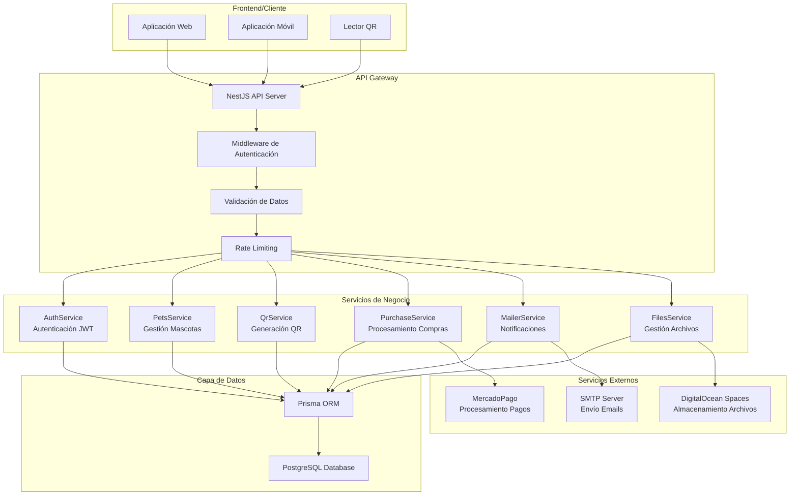
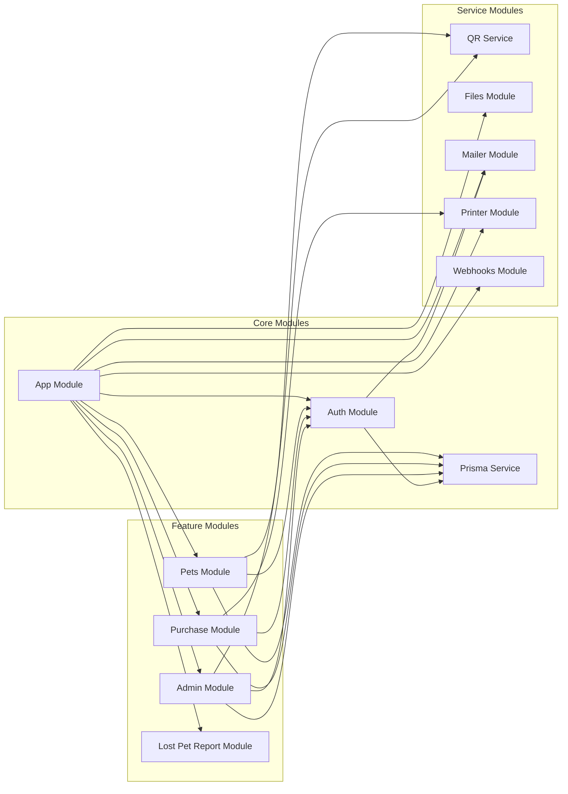
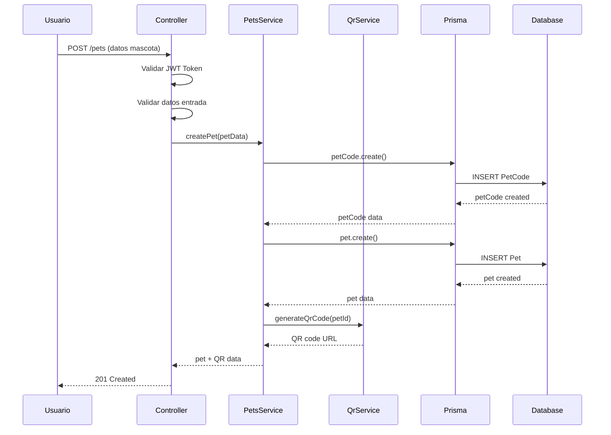
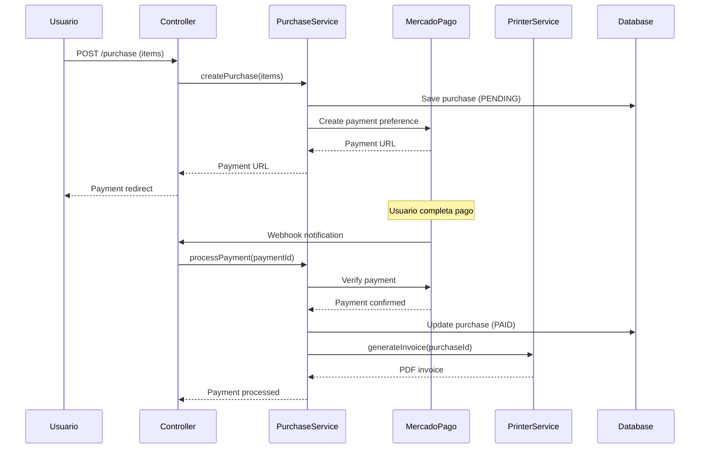

# Diagrama de Arquitectura del Sistema QR-SENA

## Arquitectura General

```mermaid
graph TB
    subgraph "Frontend/Cliente"
        A[Aplicación Web]
        B[Aplicación Móvil]
        C[Lector QR]
    end
    
    subgraph "API Gateway"
        D[NestJS API Server]
        E[Middleware de Autenticación]
        F[Validación de Datos]
        G[Rate Limiting]
    end
    
    subgraph "Servicios de Negocio"
        H[AuthService<br/>Autenticación JWT]
        I[PetsService<br/>Gestión Mascotas]
        J[QrService<br/>Generación QR]
        K[PurchaseService<br/>Procesamiento Compras]
        L[MailerService<br/>Notificaciones]
        M[FilesService<br/>Gestión Archivos]
    end
    
    subgraph "Capa de Datos"
        N[Prisma ORM]
        O[PostgreSQL Database]
    end
    
    subgraph "Servicios Externos"
        P[MercadoPago<br/>Procesamiento Pagos]
        Q[DigitalOcean Spaces<br/>Almacenamiento Archivos]
        R[SMTP Server<br/>Envío Emails]
    end
    
    A --> D
    B --> D
    C --> D
    
    D --> E
    E --> F
    F --> G
    
    G --> H
    G --> I
    G --> J
    G --> K
    G --> L
    G --> M
    
    H --> N
    I --> N
    J --> N
    K --> N
    L --> N
    M --> N
    
    N --> O
    
    K --> P
    M --> Q
    L --> R
```

## Diagrama de Módulos

```mermaid
graph LR
    subgraph "Core Modules"
        AppModule[App Module]
        AuthModule[Auth Module]
        PrismaService[Prisma Service]
    end
    
    subgraph "Feature Modules"
        PetsModule[Pets Module]
        PurchaseModule[Purchase Module]
        AdminModule[Admin Module]
        LostPetModule[Lost Pet Report Module]
    end
    
    subgraph "Service Modules"
        QrService[QR Service]
        FilesModule[Files Module]
        MailerModule[Mailer Module]
        PrinterModule[Printer Module]
        WebhooksModule[Webhooks Module]
    end
    
    AppModule --> AuthModule
    AppModule --> PetsModule
    AppModule --> PurchaseModule
    AppModule --> AdminModule
    AppModule --> LostPetModule
    AppModule --> FilesModule
    AppModule --> MailerModule
    AppModule --> PrinterModule
    AppModule --> WebhooksModule
    
    PetsModule --> QrService
    PetsModule --> AuthModule
    PetsModule --> PrismaService
    
    PurchaseModule --> AuthModule
    PurchaseModule --> PrismaService
    PurchaseModule --> PrinterModule
    
    AdminModule --> AuthModule
    AdminModule --> PrismaService
    AdminModule --> QrService
    
    AuthModule --> PrismaService
    AuthModule --> MailerModule
```

## Flujo de Datos - Registro de Mascota

```mermaid
sequenceDiagram
    participant U as Usuario
    participant C as Controller
    participant S as PetsService
    participant Q as QrService
    participant P as Prisma
    participant D as Database
    
    U->>C: POST /pets (datos mascota)
    C->>C: Validar JWT Token
    C->>C: Validar datos entrada
    C->>S: createPet(petData)
    S->>P: petCode.create()
    P->>D: INSERT PetCode
    D-->>P: petCode created
    P-->>S: petCode data
    S->>P: pet.create()
    P->>D: INSERT Pet
    D-->>P: pet created
    P-->>S: pet data
    S->>Q: generateQrCode(petId)
    Q-->>S: QR code URL
    S-->>C: pet + QR data
    C-->>U: 201 Created
```

## Flujo de Datos - Procesamiento de Compra

```mermaid
sequenceDiagram
    participant U as Usuario
    participant C as Controller
    participant P as PurchaseService
    participant M as MercadoPago
    participant PR as PrinterService
    participant DB as Database
    
    U->>C: POST /purchase (items)
    C->>P: createPurchase(items)
    P->>DB: Save purchase (PENDING)
    P->>M: Create payment preference
    M-->>P: Payment URL
    P-->>C: Payment URL
    C-->>U: Payment redirect
    
    Note over M: Usuario completa pago
    
    M->>C: Webhook notification
    C->>P: processPayment(paymentId)
    P->>M: Verify payment
    M-->>P: Payment confirmed
    P->>DB: Update purchase (PAID)
    P->>PR: generateInvoice(purchaseId)
    PR-->>P: PDF invoice
    P-->>C: Payment processed
```